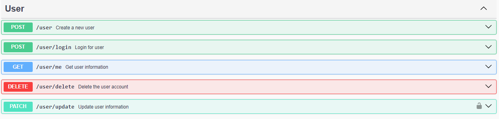
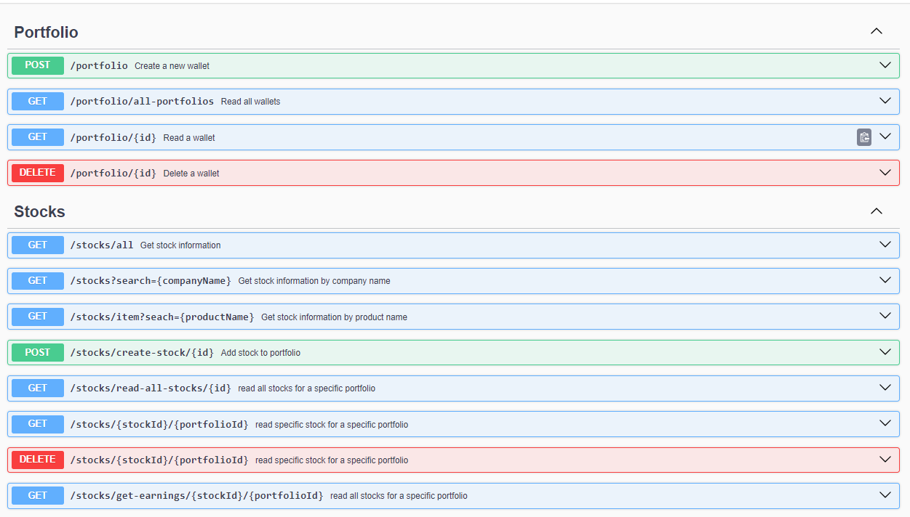

## Portfolio Financial Management System

This project provides a service where users can view market stocks for famous companies, check their prices, 
and perform analysis. Users can sign up, log in, create a portfolio, buy stocks, and calculate earnings based on stock price changes.

#### Project Overview

This service allows users to:

- View stock market data for famous companies.
- Sign up and log in to create a personal portfolio.
- Buy stocks and manage their portfolio.
- Calculate earnings based on stock price fluctuations.

#### Technologies Used

- Node.js: JavaScript runtime for server-side development.
- TypeScript: Superset of JavaScript for static typing.
- Express: Web framework for building RESTful APIs.
- Sequelize: ORM for managing database interactions.
- MYSQL: Relational database for storing user and stock data.

#### Architecture

The project follows a layered architecture to separate concerns:

- Model Layer: Defines data models using Sequelize.
- Repository Layer: Handles data access logic.
- Service Layer: Contains business logic and interacts with repositories.
- Controller Layer(business logic layer): Defines API endpoints and orchestrates requests

#### API Endpoints

###### User Authentication

###### Portfolio and Stocks

#### License
This project is a student project developed at Zagazig University and is not intended for commercial use.

#### Swagger Documentation

Swagger UI is used for API documentation. To view the Swagger documentation, navigate to http://localhost:3000/docs after running the server.

